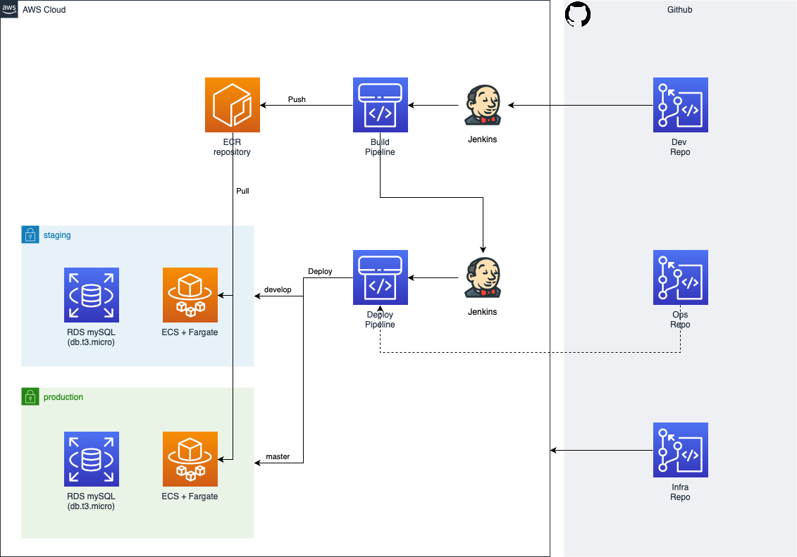

# Infrastructure repository

Repository for the wordpress practice project infrastructure resources.

This repository is a "demo" repository for the operations team that defines the infrastructure as code both for staging and production environments.

## Requirements

The minimal requirements for this repository are:

* A proper `.gitignore` file.
* A `commons` folder with the terraform inventory for the common resources.
* A `staging` folder with the terraform inventory for the staging environment resources.
* A `production` folder with the terraform inventory for the production environment resources.
* A `pre-commit` config file that use _at least_ the following hooks:
  * check-added-large-files
  * check-case-conflict
  * check-executables-have-shebangs
  * check-json
  * check-merge-conflict
  * trailing-whitespace
  * remove-tabs
  * markdownlint
  * shellcheck
* Avoid the use of cloud environment credentials. Use EC2 instance profile for jenkins to gain the necessary permissions.
* Do not use automated apply of terraform, instead, apply using your laptop.
* Use `github workflow` to validate pre-commit hooks in the remote repository on pull request and push events.
* Use S3 backend for terraform tfstates (you will have one tfstate per folder).

## Infrastructure High Level Design

